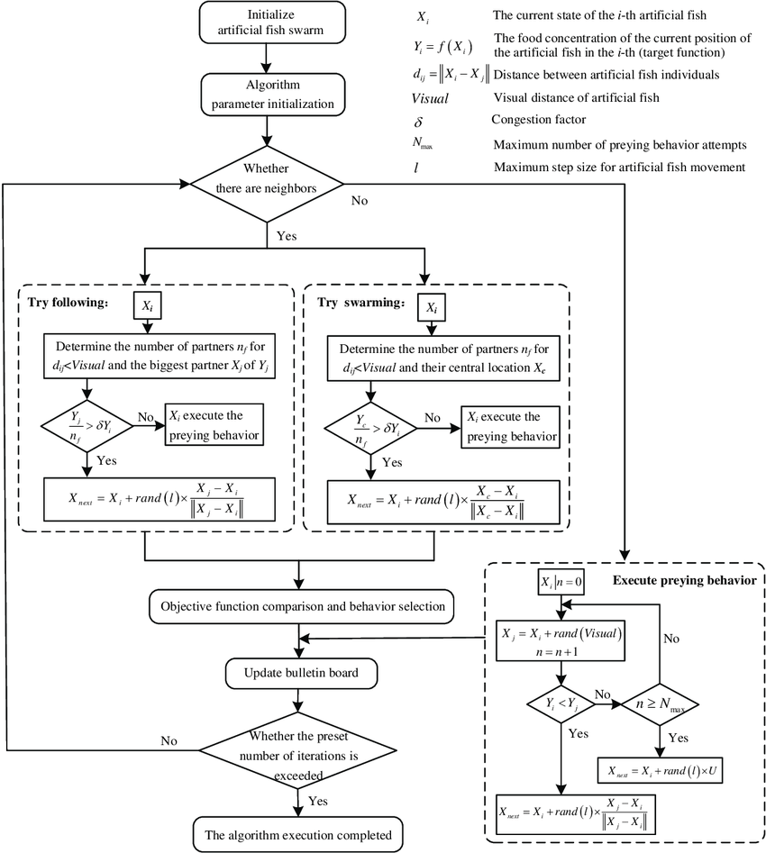
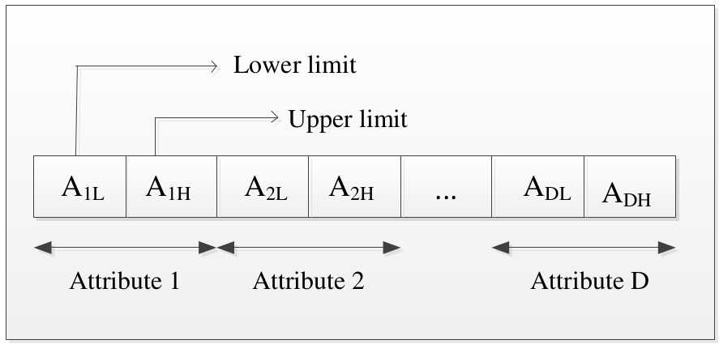
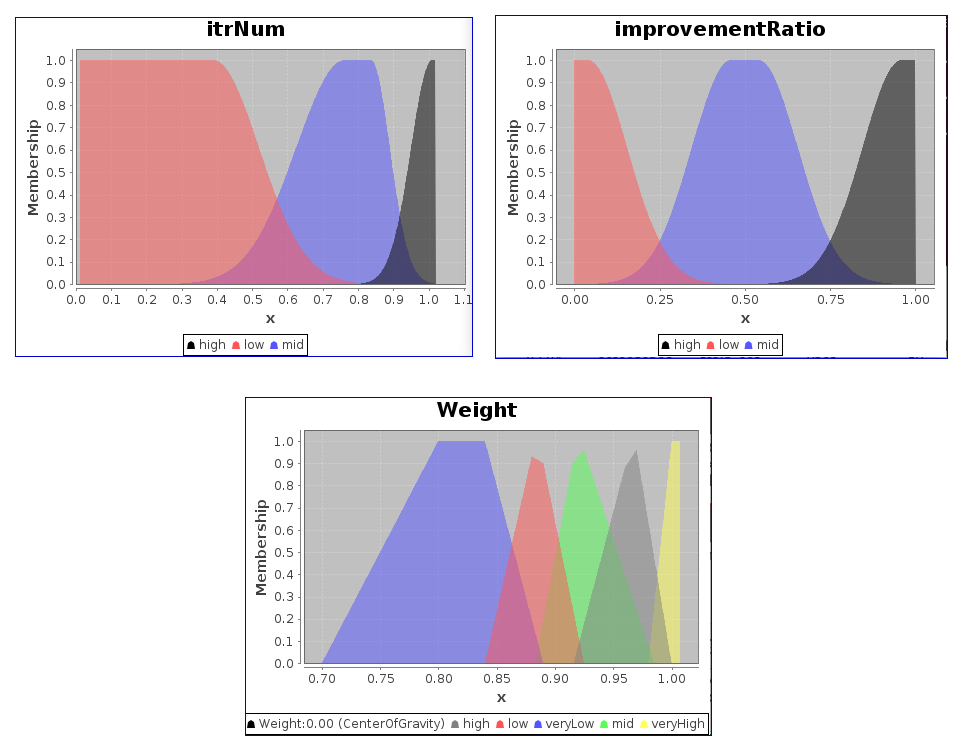
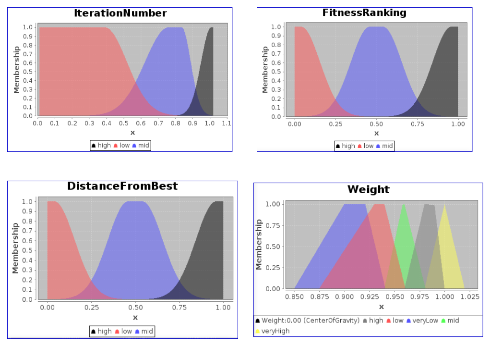

# **WEKA towards machine learning with artificial fish-swarm algorithm and fuzzy systems**

### Artificial Fish Swarm Algorithm (AFSA)

---

The Artificial Fish Algorithm is based on the collective behavior of fish in searching for food, where each fish represents a potential solution to the problem and moves in the search space to find the best possible solution.

AFSA utilize natural-inspired behaviors such as Swarm, Follow, Prey, and Movement to move towards a specific goal.

* ###  Prey Behaviour

Suppose that an AF’s current state is $X_i$. Randomly select a new state $X_j$ in its visual field according to the following equation:

$X_{j} = X_{i} + rand(-1, 1) \times  visual$

*   $X_{i}$: current state of AF
*   $visual$: represents the visual distance of AF

If $f(x_{i}) \lt f(x_{j})$, that is, satisfy the onward condition, then AF’s state at the next iteration is calculated by following equation:

  $X_{i}^{t+1} = X_{i}^{t} + Rand(0, 1) \times Step \times \frac{(X_{j} -X_{i}^{t})}{\parallel (X_{j} -X_{i}^{t})\parallel}$

*   $X_{i}^{t}$: the AF's current state
*   $X_{i}^{t+1}$: the AF’s next state
*   ${\parallel (X_{j} -X_{i})\parallel}$ represents the Euclidean distance
*   $Step$ represents the distance that AF can move for each step

* ###  Swarm Behaviour

An AF with the current state $X_{i}$ seeks the companion's number in its current neighbourhood where satisfy $d_{i, j} < visual$; and calculate their centre position $X_{center}$. If $n_{f} \times f (x_{center}) < \delta \times f (x_{i})$, that is, satisfy the onward condition, then the AF’s state at the next iteration is calculated as follows:

$X_{i}^{t+1} = X_{i}^{t} + Rand(0, 1) \times Step \times \frac{(X_{center} -X_{i}^{t})}{\parallel (X_{center} -X_{i}^{t})\parallel}$

Otherwise the AF carries out the prey behaviour.

* ###  Follow Behaviour

an AF with the current state $x_{i}$ will search for a companion, $x_{min}$, that has the lowest optimization function value among all individuals in its current neighborhood ($d_{i, j} < visual$).
if $n_{f}. f (x_{min}) < \delta \times f (x_{i})$, that is, satisfy the onward
condition, then the AF’s state at the next iteration is calculated
as follows:

$X_{i}^{t+1} = X_{i}^{t} + Rand(0, 1) \times Step \times \frac{(X_{min} -X_{i}^{t})}{\parallel (X_{min} -X_{i}^{t})\parallel}$

*   $n_{f}$ represents the companion's number in the AF current neighbourhood
*   $\delta$ is a positive constant of greater than 1, called the crowded degree factor

Otherwise the AF carries out the prey behaviour.

  
  

  [AFSA Flowchart](https://www.researchgate.net/figure/Flow-chart-of-the-artificial-fish-swarm-algorithm_fig1_327637757)

### AF-MINER

---

*   Rule Representation

 
    
<h4> Representation of an AF by a vector of 2D values</h4>

Each AF is interpreted the corresponding classificatin rule:

IF  $A_{1L} \le A_{1} \le A_{1H}$

> AND $A_{2L} \le A_{2} \le A_{2H}$

> ... ...

> AND $A_{2L} \le A_{2} \le A_{2H}$

THEN $class_{j}$

*   Fitness Function

$fitness = \frac{-n}{D} + \frac{TP}{TP + FN} \times \frac{TN}{TN + FP}$

*   $TP$: number of instances covered by the rule that are classified correctly
*   $FP$: number of instances covered by the rule that are wrongly classified
*   $FN$: number of instances not covered by the rule, whose class matches the training target class
*   $TN$: number of instances not covered by the rule, whose class differs from the training target class

### Fuzzy Uniform Fish (FUF)

---

**inputs:**

*   **Iteration number**- normalized between 0 and 1, is the proportion of current iteration number to the final iteration number.
*   **ratio of improved fish**- the proportion of the number of fish that find better positions in problem space (points with higher fitness) to the total number of fish in
comparison with previous iteration.

**output:**
*   **weight**- a value between 0 and 1 that is calculated as an output of the fuzzy engine. All of the fish in the swarm then adjust their visual and step based on
the output weight.

 
    
<h4 align="center"> Fuzzy Uniform Fish Membership functions</h4>

### Fuzzy Autonomous Fish (FAF)

---
**inputs:**

*   **Iteration number**- normalized between 0 and 1, is the proportion of current iteration number to the final iteration number.
*   **Distance from Best**- a normalized rank-based value between 0 and 1 for each fish. It is calculated based on Euclidian distance of the artificial fish from the best
artificial fish (fish with best fitness value).
*   **Fitness Ranking**- all fish are sorted and ranked based on the Euclidian Distance from the best fish. 

**output:**
*   **weight**- a value between 0 and 1 that is calculated as an output of the fuzzy engine. each artificial fish adjust its visual and step parameter individually and independent of the rest fish in FAF.

 
    
<h4 align="center"> Fuzzy Autonomous Fish Membership functions</h4>

### result

---
| Dataset       	| AF-Miner (1) 	| FUF-Miner  (2) 	| FAF-Miner (3) 	| P-Value (1,2) 	| P-Value (1,3) 	|
|---------------	|:---------------:	|:-----------------:	|:----------------:	|:----------------:	|:----------------:	|
|      Iris     	|      89.13      	| 89.20             	| 88.80            	| 0.897187         	| 0.581083         	|
| Pima_diabetes 	|      72.28      	| 71.75             	| 71.37            	| 0.040373         	| 0.00582          	|
|     Glass     	|      58.75      	| 59.05             	| 56.35            	| 0.720355         	| 0.00153          	|
|   Ionosphere  	|      80.17      	| 81.76             	| 78.72            	| 0.113912         	| 0.183558         	|
|    Segment    	|      76.29      	| 76.48             	| 79.97            	| 0.758780         	| 3.26262E-12      	|
